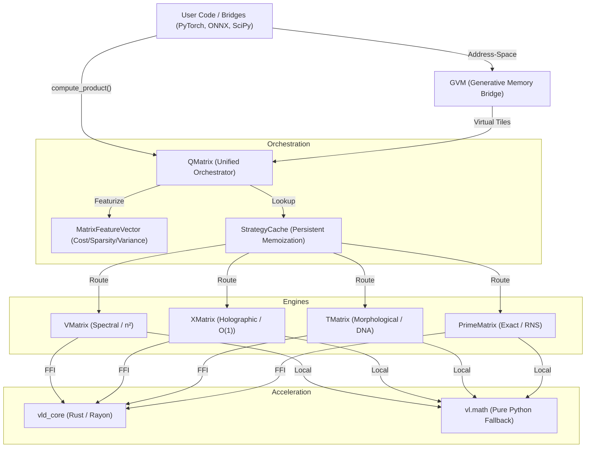

# Matrix-V SDK: Architectural Map & Connection Report
--------------------------------------------------

This document identifies every major component of the Matrix-V SDK, their inter-dependencies, and the "Order of Operations" for core workloads.

## 1. System Architecture Diagram

## 2. Layer Definitions

### A. Orchestration Layer (`vl/substrate/unified.py`, `matrix.py`)
- **`QMatrix`**: The primary entry point. Manages tiling for exascale matrices and directs the flow.
- **`MatrixFeatureVector`**: Samples the input (O(1) complexity) to detect sparsity, rank-hints, and structural periodicity.
- **`StrategyCache`**: Stores "Winners" (the most efficient engine) for specific shape classes.

### B. Substrate Layer (`vl/substrate/`)
- **`TMatrix` / `T_MatrixVLinear`**: The newest generator. Replaces bulk parameter storage with "Morphological DNA".
- **`VMatrix`**: Optimized for "standard" dense data using Johnson-Lindenstrauss random projections.
- **`XMatrix`**: Uses HDC (Hyperdimensional Computing) to track results as bit-signatures.
- **`PrimeMatrix`**: Handles exact arithmetic for security or high-precision industrial sims (e.g., FEM).

### C. Native Layer (`rust_core/`, `vl/substrate/acceleration.py`)
- **`acceleration.py`**: A unified dispatcher. It attempts to load classes from `vld_core`.
- **`vld_core` (Rust)**: Parallelized kernels for Gielis Radius, Hilbert Encoding, and RNS arithmetic.

## 3. Order of Operations (Lifecycle of a Multiply)

1.  **Ingestion**: Input is received as List, NumPy, or GVM address.
2.  **Cost Gate**: If FLOPs < 262,144, it immediately defaults to `naive_multiply` to avoid routing overhead.
3.  **Featurization**: A `MatrixFeatureVector` is generated. It samples a small subset of rows to calculate statistical features.
4.  **Strategy Routing**:
    *   Check persistence cache for known shape.
    *   If unknown: Use the **Adaptive Classifier** (weights calculated via `SpectralUtility`).
    *   For **T-Matrix**: Weights are *projected* JIT from DNA parameters rather than loaded.
5.  **Execution**: 
    *   Engine calls `self.native` (Rust).
    *   If Rust fails/missing: Fallback to `vl.math` (NumPy/Python).
6.  **Resolution**: The manifold is materialized as a standard data structure or returned as a symbolic signature for further chain-multiplication.

## 4. Connection Matrix

| Source | Target | Dependency Type | Purpose |
| :--- | :--- | :--- | :--- |
| `QMatrix` | `GenerativeMemory` | Direct Import | GVM-backed tiled storage |
| `QMatrix` | `MPSNode` | Lazy Import | Quantum-informed rank estimation |
| `TMatrix` | `TMatrixEngine` | Direct Dispatch | Native Gielis/Holographic projection |
| `VMatrix` | `V_SeriesEngine` | Bridge | JL-Projection kernels |
| `Extensions/*` | `QMatrix` | API Wrapper | Exporting SDK logic to industry tools |
| `Acceleration` | `vld_core` | PyO3/C-ABI | Performance critical math |
